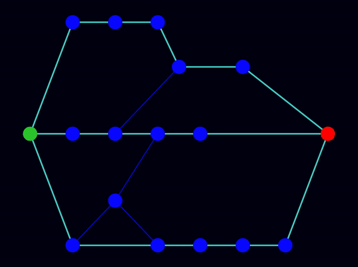

# Lem-in

In this project, we are given an ant farm composed of rooms and links, and our task is to find the optimum path combination to move the ants as fast as possible from start to end. We must avoid traffic jams because the rules dictate each room, except the start and end rooms can contain one ant at a time.

With this project, we gained hands-on experience in graph theory, maximum flow algorithms, adjacency list representation of graphs, and implementing hashmaps in the C programming language.

For detailed instructions, refer to [the subject](subject.pdf).

<p align="center">
  
</p>


## Input
Our program receives data in the following format from stdin:
- Number of ants (positive integers)
- Rooms (name coord_x coord_y)
- ##start command followed by the start rooms information
- ##end command followed by the end room information
- Links (name1-name2)
- Comments can be anywhere; they start with a '#'

An example input:
```
#comment
3
##start
start 1 0
##end
end 5 0
room1 9 0
room2 13 0
#comment
start-room1
room1-room2
room2-end
```

## Output
Results are displayed in stdout in the following format:
- First, the given map is printed
- Then, ants (L1-room_name, L2-another_room_name, ...) moving in rooms are printed
```
#comment
3
##start
start 1 0
##end
end 5 0
room1 9 0
room2 13 0
#comment
start-room1
room1-room2
room2-end

L1-room1
L1-room2 L2-room1
L1-end L2-room2 L3-room1
L2-end L3-room2
L3-end
```

## Strategy

## Installation
```
git clone git@github.com:Bengissimo/Lem-in.git
```
```
make
```

## Usage
```
Usage: ./lem-in [OPTION] < valid_map

 -h     help
 -p     print sets of possible paths and number of lines to print
 -v     enable visualizer
```

## Visualizer
```
Visualizer usage: ./lem-in -v < valid_map | python3 visualizer/visualizer.py [OPTION]

 --coord        to use coordinates, random nodes position by default
 --slow         slow animation of moving ants
 --fast         fast animation of moving ants
 --big          good for big maps with small node size

Visualizer uses networkx, matplotlib, numpy, scipy. Be sure that you have these packages installed

pip3 install networkx matplotlib numpy scipy
```

## Test scripts


